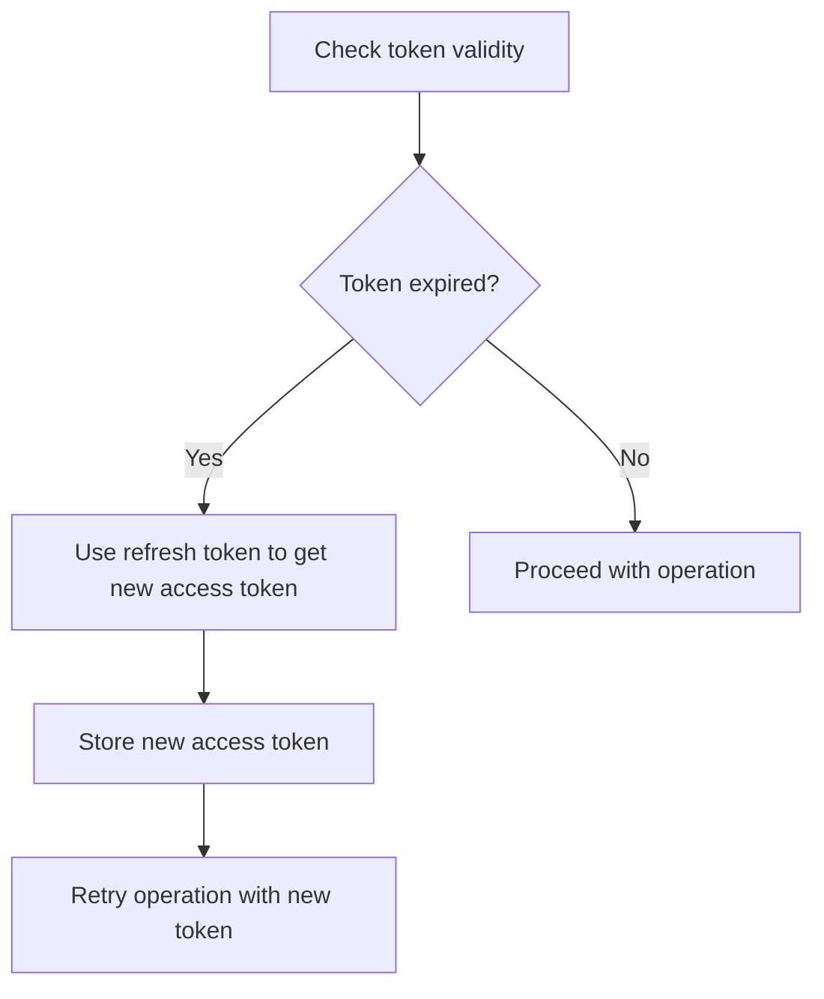
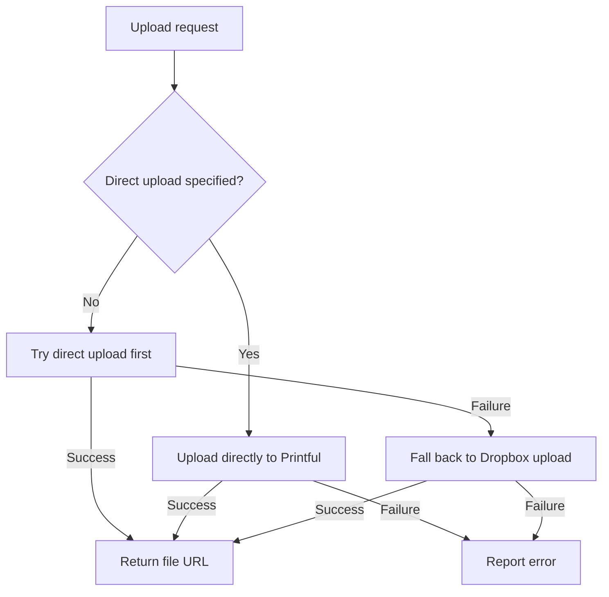

# Dropbox Token Refresh Implementation

This implementation provides a solution to prevent Dropbox token expiration issues in the Printful upload pipeline. It includes two main components:

1. **OAuth 2.0 Token Refresh**: Automatically refreshes Dropbox access tokens when they expire
2. **Direct Printful Upload**: Provides an alternative upload method that bypasses Dropbox entirely

## Features

- **Automatic Token Refresh**: Uses Dropbox's OAuth 2.0 refresh tokens to automatically renew access tokens
- **Secure Token Storage**: Encrypts refresh tokens for secure storage
- **Fallback Strategy**: Tries direct upload to Printful first, falls back to Dropbox if needed
- **Migration Utility**: Helps migrate from legacy access tokens to OAuth 2.0
- **Improved Error Handling**: Provides clear, actionable error messages

## Setup Instructions

### 1. Create a Dropbox App

1. Go to [Dropbox Developer Apps](https://www.dropbox.com/developers/apps)
2. Click "Create app"
3. Select "Scoped access"
4. Choose "Full Dropbox" access
5. Give your app a name (e.g., "Printful Uploader")
6. Click "Create app"
7. In the settings tab, add `http://localhost:3000/oauth-callback` to the OAuth 2 redirect URIs
8. Note your App key and App secret

### 2. Update Environment Variables

Add the following variables to your `.env` file:

```
# Dropbox OAuth Configuration
DROPBOX_APP_KEY=your_app_key
DROPBOX_APP_SECRET=your_app_secret
TOKEN_ENCRYPTION_KEY=your_encryption_key_for_token_storage
```

You can generate a random encryption key with:

```bash
node -e "console.log(require('crypto').randomBytes(32).toString('hex'))"
```

### 3. Run the Migration Utility

```bash
node migrateDropboxToken.js
```

This utility will:
- Check if your Dropbox OAuth credentials are set up correctly
- Guide you through the OAuth authorization flow
- Securely store your refresh token

## Usage

### Using Direct Upload to Printful

To bypass Dropbox entirely and upload directly to Printful:

```bash
node uploadToPrintful.js --direct-upload
```

### Using Dropbox with Auto-Refresh

The default behavior now includes automatic token refresh:

```bash
node uploadToPrintful.js
```

## How It Works

### Token Refresh Flow



### Upload Strategy



## Troubleshooting

### OAuth Setup Issues

If you encounter issues during OAuth setup:

1. Verify your app key and secret are correct
2. Ensure your redirect URI is properly configured
3. Check that your app has the necessary scopes (files.content.write, sharing.write)

### Upload Failures

If file uploads fail:

1. Check your internet connection
2. Verify file size is within Printful's limits (typically 200MB)
3. Ensure file format is supported by Printful
4. Try the `--direct-upload` option to bypass Dropbox

## Security Considerations

- Refresh tokens are stored encrypted on disk
- Access tokens are never stored permanently
- The encryption key should be kept secure and not shared