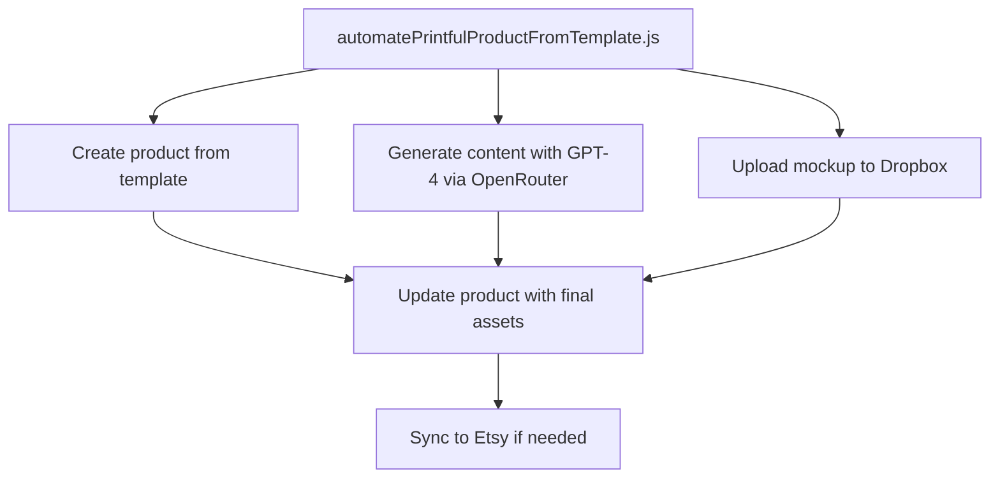

# Printful Product Automation Plan

## Overview

This plan outlines the implementation of a new script (`automatePrintfulProductFromTemplate.js`) that will automate the creation and publishing of Printful products using a saved blank template for the Gildan 18000 sweatshirt. The script will:

1. Create a new product from the saved template (ID: 85534641)
2. Generate title, description, and tags using GPT (via OpenRouter) based on the text on the shirt
3. Upload the final mockup image to Dropbox
4. Update the Printful product with the final image mockup (positioned at "middle top, front") and GPT-generated content
5. (Optional) Ensure it's synced to Etsy (Printful may auto-sync based on store settings)

## System Architecture



## Implementation Details

### 1. Environment Setup

The script will use the following environment variables:
- `PRINTFUL_API_KEY` - For Printful API authentication
- `PRINTFUL_STORE_ID` - For identifying the Printful store
- `OPENROUTER_API_KEY` - For GPT content generation
- `DROPBOX_ACCESS_TOKEN` - For Dropbox file uploads
- `DROPBOX_FOLDER_PATH` - For specifying where to store files in Dropbox

### 2. Create Product From Saved Template

This function will create a new product using the existing template ID:

```javascript
/**
 * Creates a new product from a saved template
 * @param {number} templateId - The ID of the saved template
 * @returns {Promise<number>} - The ID of the created product
 */
async function createProductFromTemplate(templateId) {
  try {
    console.log(`⏳ Creating product from template ID: ${templateId}`);
    
    const response = await fetch('https://api.printful.com/store/products', {
      method: 'POST',
      headers: {
        'Authorization': `Bearer ${process.env.PRINTFUL_API_KEY}`,
        'Content-Type': 'application/json',
      },
      body: JSON.stringify({
        template_id: templateId,
        sync_product: {
          name: "TEMP - Placeholder",
          description: "Auto-generated product awaiting final assets.",
        },
      }),
    });
    
    const data = await response.json();
    
    if (!response.ok) {
      throw new Error(`Failed to create product: ${JSON.stringify(data)}`);
    }
    
    const productId = data.result.id;
    console.log(`✅ Product created with ID: ${productId}`);
    return productId;
  } catch (error) {
    console.error(`❌ Error creating product from template:`, error.message);
    throw error;
  }
}
```

### 3. Generate GPT Product Text

This function will use OpenRouter to generate product content:

```javascript
/**
 * Generates product text using GPT via OpenRouter
 * @param {string} sweatshirtText - The text on the sweatshirt
 * @returns {Promise<Object>} - The generated content
 */
async function generateProductText(sweatshirtText) {
  try {
    console.log(`⏳ Generating product text for: ${sweatshirtText}`);
    
    const prompt = `Generate an SEO-optimized Etsy title, description, and 13 tags for a sweatshirt that says: "${sweatshirtText}". Respond in this format: 
---
Title: ...
Description: ...
Tags: tag1, tag2, tag3...
`;

    const response = await fetch("https://openrouter.ai/api/v1/chat/completions", {
      method: "POST",
      headers: {
        "Authorization": `Bearer ${process.env.OPENROUTER_API_KEY}`,
        "Content-Type": "application/json",
      },
      body: JSON.stringify({
        model: "gpt-4o",
        messages: [{ role: "user", content: prompt }],
      }),
    });
    
    const data = await response.json();
    
    if (!response.ok) {
      throw new Error(`OpenRouter API error: ${JSON.stringify(data)}`);
    }
    
    const content = data.choices[0].message.content;
    console.log(`✅ Product text generated successfully`);
    
    // Parse the content into structured data
    const result = {
      title: extractField("Title", content),
      description: extractField("Description", content),
      tags: extractTags(content)
    };
    
    return result;
  } catch (error) {
    console.error(`❌ Error generating product text:`, error.message);
    throw error;
  }
}

/**
 * Extracts a field from the GPT response
 * @param {string} label - The field label
 * @param {string} text - The text to extract from
 * @returns {string} - The extracted field value
 */
function extractField(label, text) {
  const regex = new RegExp(`${label}:\\s*(.+?)(?=\\n\\n|\\n[A-Z]|$)`, 's');
  const match = text.match(regex);
  return match ? match[1].trim() : "";
}

/**
 * Extracts tags from the GPT response
 * @param {string} text - The text to extract from
 * @returns {Array<string>} - The extracted tags
 */
function extractTags(text) {
  const tagsSection = extractField("Tags", text);
  return tagsSection
    .split(',')
    .map(tag => tag.trim())
    .filter(tag => tag.length > 0);
}
```

### 4. Upload Mockup to Dropbox

This function will upload the mockup image to Dropbox:

```javascript
/**
 * Uploads a file to Dropbox and returns a shared link
 * @param {string} filePath - Path to the local file
 * @returns {Promise<string>} - The Dropbox shared link
 */
async function uploadMockupToDropbox(filePath) {
  try {
    console.log(`⏳ Uploading mockup to Dropbox: ${filePath}`);
    
    // Initialize Dropbox client
    const dropbox = new Dropbox({ accessToken: process.env.DROPBOX_ACCESS_TOKEN });
    
    // Read the file as a buffer
    const fileBuffer = fs.readFileSync(filePath);
    const fileName = path.basename(filePath);
    
    // Ensure the folder path is properly formatted
    const folderPath = process.env.DROPBOX_FOLDER_PATH.endsWith('/') 
      ? process.env.DROPBOX_FOLDER_PATH.slice(0, -1) 
      : process.env.DROPBOX_FOLDER_PATH;
    
    const dropboxFilePath = `${folderPath}/${fileName}`;
    
    // Upload the file to Dropbox
    const uploadResponse = await dropbox.filesUpload({
      path: dropboxFilePath,
      contents: fileBuffer,
      mode: { '.tag': 'overwrite' }
    });
    
    console.log(`✅ File uploaded to Dropbox: ${uploadResponse.path_display}`);
    
    // Create a shared link
    const linkResponse = await dropbox.sharingCreateSharedLinkWithSettings({
      path: uploadResponse.path_display,
      settings: {
        requested_visibility: { '.tag': 'public' }
      }
    });
    
    // Convert to direct link
    const directLink = linkResponse.url
      .replace('www.dropbox.com', 'dl.dropboxusercontent.com')
      .replace('?dl=0', '');
    
    console.log(`✅ Dropbox shared link created: ${directLink}`);
    return directLink;
  } catch (error) {
    console.error(`❌ Error uploading to Dropbox:`, error.message);
    throw error;
  }
}
```

### 5. Update Product with Final Assets (Positioned at "Middle Top, Front")

This function will update the product with the final assets, positioning the design at "middle top, front":

```javascript
/**
 * Updates a product with final assets
 * @param {number} productId - The ID of the product to update
 * @param {string} imageUrl - The URL of the mockup image
 * @param {string} title - The product title
 * @param {string} description - The product description
 * @returns {Promise<Object>} - The updated product
 */
async function updateProductWithAssets(productId, imageUrl, title, description) {
  try {
    console.log(`⏳ Updating product ${productId} with final assets`);
    
    // Define the print area dimensions for Gildan 18000 sweatshirt
    const areaWidth = 1800;
    const areaHeight = 2400;
    
    // Set design dimensions - full width but proportional height
    const designWidth = areaWidth;
    const designHeight = Math.round(areaWidth / 2); // Proportional height (half of width)
    
    // Position at middle top - centered horizontally, at the top portion of the print area
    // For "middle top" positioning, we center horizontally (left = 0 for full width)
    // but place it at the top portion of the print area (about 20% down from the top)
    const topPosition = Math.round(areaHeight * 0.2); // 20% down from the top
    
    // Define the position object
    const position = {
      area_width: areaWidth,
      area_height: areaHeight,
      width: designWidth,
      height: designHeight,
      top: topPosition,
      left: 0, // Centered horizontally (since we're using full width)
      limit_to_print_area: true
    };
    
    console.log(`📐 Using position: top=${position.top}, left=${position.left}, width=${position.width}, height=${position.height}`);
    
    const response = await fetch(`https://api.printful.com/store/products/${productId}`, {
      method: 'PUT',
      headers: {
        'Authorization': `Bearer ${process.env.PRINTFUL_API_KEY}`,
        'Content-Type': 'application/json',
      },
      body: JSON.stringify({
        sync_product: {
          name: title,
          description: description,
        },
        files: [
          {
            placement: "front",
            url: imageUrl,
            position: position
          },
        ],
      }),
    });
    
    const data = await response.json();
    
    if (!response.ok) {
      throw new Error(`Failed to update product: ${JSON.stringify(data)}`);
    }
    
    console.log(`✅ Product updated successfully`);
    return data.result;
  } catch (error) {
    console.error(`❌ Error updating product:`, error.message);
    throw error;
  }
}
```

### 6. Main Function

The main function will orchestrate the entire process:

```javascript
/**
 * Main function to automate product creation
 * @param {string} sweatshirtText - The text on the sweatshirt
 * @param {string} mockupPath - Path to the mockup image
 * @returns {Promise<Object>} - The created product
 */
async function automateProductCreation(sweatshirtText, mockupPath) {
  try {
    console.log(`🚀 Starting product automation for: ${sweatshirtText}`);
    
    // Step 1: Create product from template
    const TEMPLATE_ID = 85534641;
    const productId = await createProductFromTemplate(TEMPLATE_ID);
    
    // Step 2: Generate product text with GPT
    const gptOutput = await generateProductText(sweatshirtText);
    
    // Step 3: Upload mockup to Dropbox
    const imageUrl = await uploadMockupToDropbox(mockupPath);
    
    // Step 4: Update product with final assets
    const updatedProduct = await updateProductWithAssets(
      productId,
      imageUrl,
      gptOutput.title,
      gptOutput.description
    );
    
    console.log(`🎉 Product automation completed successfully!`);
    console.log(`📊 Product ID: ${updatedProduct.id}`);
    console.log(`📊 Product URL: ${updatedProduct.external_url || 'N/A'}`);
    
    return updatedProduct;
  } catch (error) {
    console.error(`❌ Product automation failed:`, error.message);
    throw error;
  }
}
```

### 7. Command Line Interface

The script will include a CLI for easy use:

```javascript
// Command line arguments
const args = process.argv.slice(2);

// Show help text if requested
if (args.includes('--help') || args.includes('-h')) {
  console.log(`
📋 automatePrintfulProductFromTemplate.js Help:

This script automates the creation of Printful products from a saved template.

Usage:
  node automatePrintfulProductFromTemplate.js <sweatshirtText> <mockupPath>

Arguments:
  sweatshirtText    The text on the sweatshirt (e.g., "PASTA")
  mockupPath        Path to the mockup image file

Options:
  --help, -h        Show this help text
  --dry-run, -d     Run in dry-run mode (no actual API calls)

Examples:
  node automatePrintfulProductFromTemplate.js "PASTA" "./export-mockups/PASTA/PASTA-BLACK.png"
  `);
  process.exit(0);
}

// Check for required arguments
if (args.length < 2) {
  console.error('❌ Error: Missing required arguments');
  console.log('Run with --help for usage information');
  process.exit(1);
}

// Parse arguments
const sweatshirtText = args[0];
const mockupPath = args[1];
const isDryRun = args.includes('--dry-run') || args.includes('-d');

// Run the script
if (isDryRun) {
  console.log(`🔍 DRY RUN: Would create product for "${sweatshirtText}" using mockup: ${mockupPath}`);
  process.exit(0);
}

automateProductCreation(sweatshirtText, mockupPath)
  .then(product => {
    console.log(`✅ Product created successfully: ${product.id}`);
    process.exit(0);
  })
  .catch(error => {
    console.error(`❌ Error:`, error.message);
    process.exit(1);
  });
```

## Complete Script Structure

The complete script will be structured as follows:

```javascript
/**
 * automatePrintfulProductFromTemplate.js
 * 
 * This script automates the creation and publishing of a Printful product using a saved blank template.
 * It creates a new product, generates content with GPT, uploads mockups to Dropbox, and updates the product.
 */

// Import required modules
require('dotenv').config();
const fs = require('fs');
const path = require('path');
const { Dropbox } = require('dropbox');

// Configuration
const TEMPLATE_ID = 85534641; // Gildan 18000 sweatshirt template

// Function implementations
async function createProductFromTemplate(templateId) { /* ... */ }
async function generateProductText(sweatshirtText) { /* ... */ }
function extractField(label, text) { /* ... */ }
function extractTags(text) { /* ... */ }
async function uploadMockupToDropbox(filePath) { /* ... */ }
async function updateProductWithAssets(productId, imageUrl, title, description) { /* ... */ }
async function automateProductCreation(sweatshirtText, mockupPath) { /* ... */ }

// Command line interface
// ...
```

## Error Handling Strategy

The script will implement robust error handling:

1. Each function will have try/catch blocks to handle specific errors
2. Detailed error messages will be logged to the console
3. The script will exit with a non-zero status code on failure
4. For critical API calls, a retry mechanism will be implemented

## Testing Strategy

1. Test with a dry run first to verify the script logic
2. Test with a single product to verify the entire workflow
3. Verify that the product is created with the correct template
4. Verify that the GPT-generated content is applied correctly
5. Verify that the mockup image is uploaded and linked properly
6. Verify that the product is updated with the correct assets and positioning
7. Visually inspect the product preview to ensure the design is positioned at "middle top, front"

## Future Enhancements

1. Add support for batch processing multiple products
2. Implement a caching mechanism for GPT-generated content
3. Add support for different product types and templates
4. Implement a web interface for monitoring and managing products
5. Add support for updating existing products

## Implementation Steps

1. Create the script file with the basic structure
2. Implement the core functions one by one
3. Add error handling and logging
4. Implement the command line interface
5. Test with a dry run
6. Test with a single product
7. Refine and optimize as needed