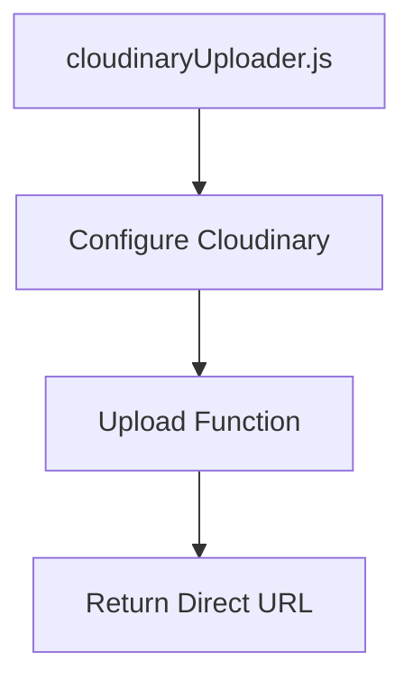
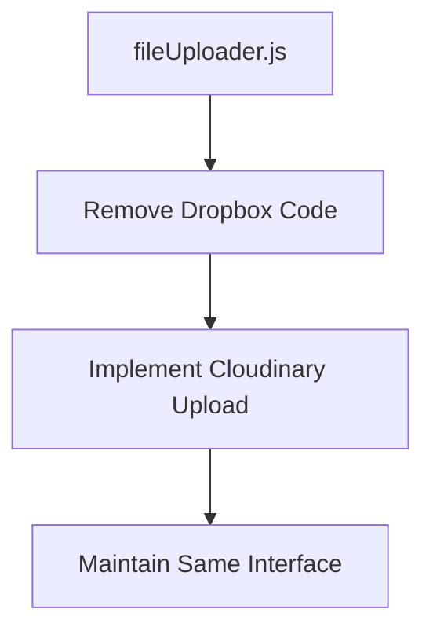
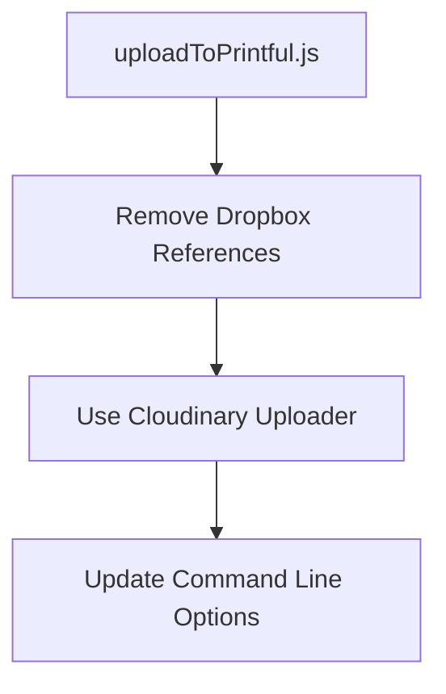

# Cloudinary Migration Plan: Replacing Dropbox as Primary Host

## Current System Analysis

The current system uses a multi-layered approach for file uploads:

1. **Primary Method**: Direct upload to Printful via their API
2. **Fallback Method**: Upload to Dropbox, create a shared link, then pass that link to Printful

The fallback mechanism is complex, requiring:
- OAuth token management with refresh capabilities
- Encryption/decryption of tokens
- Multiple API calls to Dropbox for upload and link creation

## Migration Goals

1. Replace Dropbox with Cloudinary as the file hosting solution
2. Simplify the upload process by eliminating the complex token management
3. Maintain the same functionality for the end-user
4. Keep the same interface for other parts of the application that use the upload functionality

## Implementation Plan

### 1. Create the Cloudinary Uploader Module

First, we'll create a dedicated module for Cloudinary uploads:



### 2. Update the File Uploader Module

Next, we'll update the existing file uploader to use Cloudinary instead of Dropbox:



### 3. Update Upload to Printful Process

Finally, we'll update the main upload process to use the new uploader:



## Detailed Implementation Steps

### Step 1: Update .env File

Add Cloudinary credentials to your .env file:

```
CLOUDINARY_CLOUD_NAME=dw7k1nob9
CLOUDINARY_API_KEY=122433767661295
CLOUDINARY_API_SECRET=J2_BLqLM8WNAio6KG_RVomSbkW8
```

### Step 2: Create cloudinaryUploader.js

Create a new file that will handle all Cloudinary operations:

```javascript
// cloudinaryUploader.js
const cloudinary = require('cloudinary').v2;
require('dotenv').config();

cloudinary.config({
  cloud_name: process.env.CLOUDINARY_CLOUD_NAME,
  api_key: process.env.CLOUDINARY_API_KEY,
  api_secret: process.env.CLOUDINARY_API_SECRET,
});

/**
 * Uploads an image to Cloudinary and returns the direct secure URL
 * @param {string} filePath
 * @returns {Promise<string>} secure URL
 */
async function uploadToCloudinary(filePath) {
  try {
    const result = await cloudinary.uploader.upload(filePath, {
      folder: 'printful_uploads',
      use_filename: true,
      unique_filename: false,
      overwrite: true,
    });
    console.log(`✅ Cloudinary upload success: ${result.secure_url}`);
    return result.secure_url;
  } catch (err) {
    console.error(`❌ Cloudinary upload failed: ${err.message}`);
    throw err;
  }
}

module.exports = { uploadToCloudinary };
```

### Step 3: Update fileUploader.js

Completely rewrite the file uploader to use Cloudinary instead of Dropbox:

```javascript
// fileUploader.js
const { uploadToCloudinary } = require('./cloudinaryUploader');

async function uploadFileWithFallbackStrategy(filePath) {
  try {
    return await uploadToCloudinary(filePath);
  } catch (err) {
    console.error(`❌ Cloudinary upload failed: ${err.message}`);
    throw err;
  }
}

module.exports = { uploadFileWithFallbackStrategy };
```

### Step 4: Update uploadToPrintful.js

Update the main script to remove Dropbox references and use the new uploader:

1. Remove Dropbox initialization and imports
2. Update the command line help text
3. Remove the fallback option since we're only using Cloudinary now

## Testing Plan

1. Test basic file upload to Cloudinary
2. Test the integration with Printful
3. Test error handling

## Rollback Plan

If issues arise:
1. Keep the original files backed up
2. Revert to the original implementation if needed

## Future Enhancements

Potential future improvements:
1. Add image optimization using Cloudinary's transformation features
2. Implement better error handling and retry logic
3. Add caching for frequently accessed images