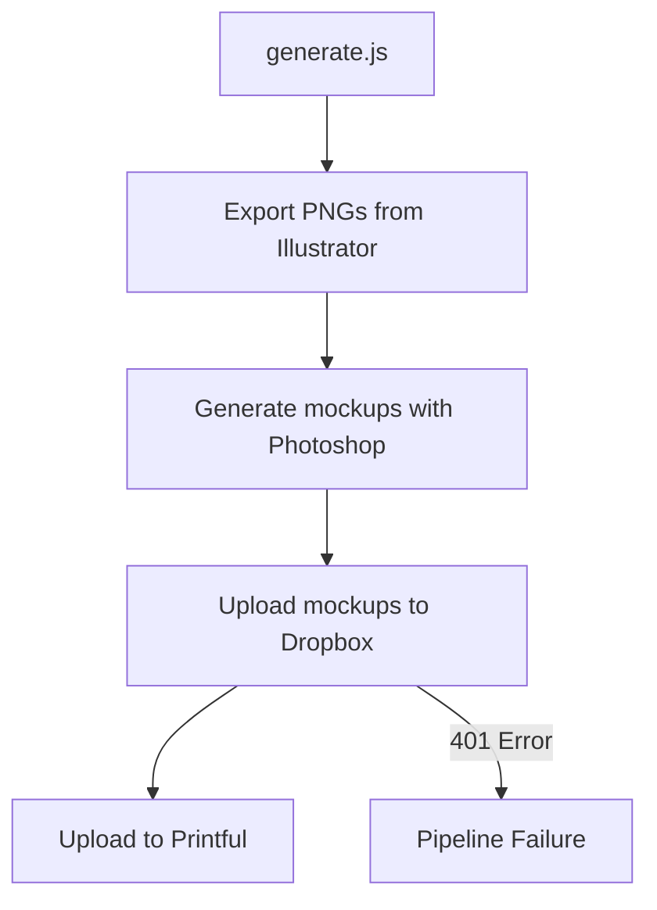
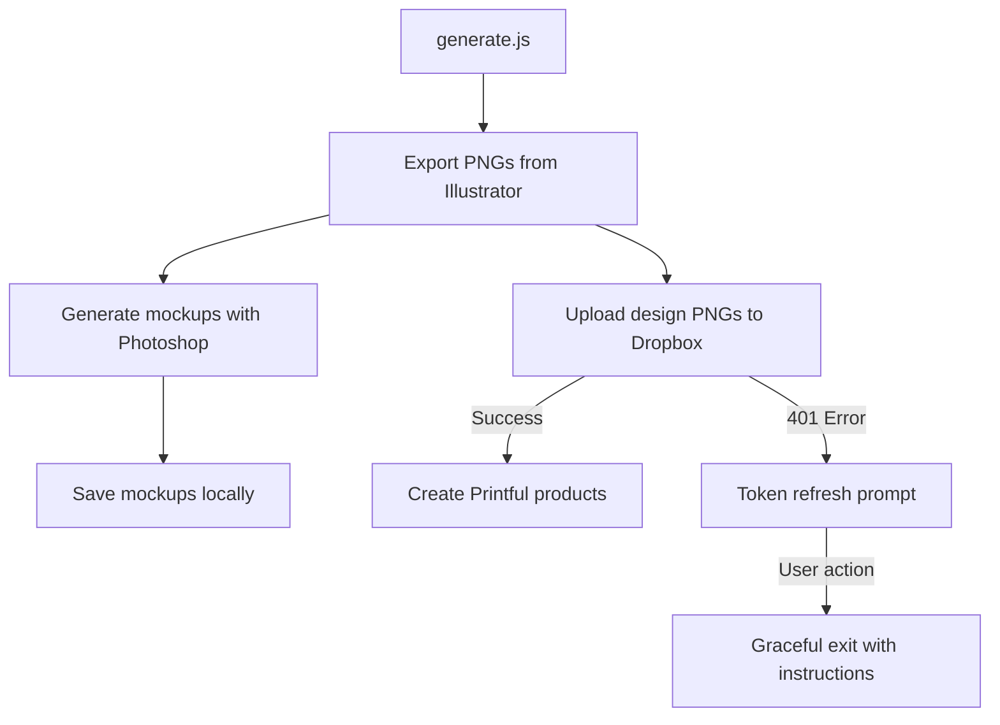

# Implementation Plan: Updating generate.js to Fix Dropbox Integration Issues

## Overview
This plan outlines the necessary changes to update the `generate.js` pipeline to address two key issues:
1. Remove Dropbox upload functionality for mockups
2. Implement better handling for Dropbox token expiration errors

## Current System Analysis



## Target System Architecture



## Implementation Details

### 1. Remove Dropbox Upload for Mockups

#### Code Changes:
- Identify and remove/comment out any calls to `uploadMockupToDropbox()` or similar functions
- Ensure mockups are only saved locally in the designated output directory
- Update any dependent code that expects mockups to be in Dropbox
- Preserve Dropbox upload logic only for design images (e.g., PASTA.png) needed for Printful

#### Implementation Strategy:
1. Analyze the current flow in `generate.js` to identify where mockup uploads occur
2. Comment out or remove these sections while preserving the local saving functionality
3. Update any log messages or status reporting to reflect the new workflow
4. Ensure the pipeline continues to the next step even if mockups are not uploaded

### 2. Fix Dropbox Token Expiration Handling

#### Code Changes:
- Implement error detection for Dropbox 401 errors with `.tag === 'expired_access_token'`
- Add user-friendly error messages with clear instructions for token renewal
- Implement graceful pipeline continuation for non-critical Dropbox operations
- Add token validation check before attempting any Dropbox operations

#### Implementation Strategy:
1. Create a dedicated function to check Dropbox token validity
2. Implement error handling that specifically catches and identifies token expiration
3. Add clear user instructions for token renewal
4. Modify the pipeline to continue with local operations even if Dropbox fails

### 3. Error Handling Improvements

#### Code Changes:
- Implement more granular try/catch blocks around Dropbox operations
- Add conditional logic to skip Dropbox-dependent steps if authentication fails
- Ensure errors are properly logged with actionable information
- Prevent cascading failures from Dropbox issues

#### Implementation Strategy:
1. Refactor error handling in Dropbox-related functions
2. Add specific error types and messages for different failure scenarios
3. Implement fallback behavior for critical operations
4. Ensure the pipeline can complete its essential functions without Dropbox

## Code Structure Changes

```javascript
// Example of improved error handling for Dropbox operations

// Before attempting any Dropbox operations
async function validateDropboxToken() {
  try {
    // Simple API call to check token validity
    await dbx.usersGetCurrentAccount();
    return true;
  } catch (error) {
    if (error.status === 401 && error.error?.error?.['.tag'] === 'expired_access_token') {
      console.error('\n❌ Dropbox token has expired. Please refresh your token.');
      console.log('\n🔑 To refresh your token:');
      console.log('1. Go to https://www.dropbox.com/developers/apps');
      console.log('2. Select your app');
      console.log('3. Generate a new access token');
      console.log('4. Update your .env file with the new token');
      return false;
    }
    console.error('\n❌ Error validating Dropbox token:', error.message);
    return false;
  }
}

// Modified upload function with better error handling
async function uploadDesignToDropbox(filePath, dropboxPath) {
  // Skip if token validation failed
  if (!(await validateDropboxToken())) {
    console.log(`⚠️ Skipping Dropbox upload for ${filePath} due to authentication issues`);
    return null;
  }
  
  try {
    // Existing upload logic
    // ...
    return result;
  } catch (error) {
    handleDropboxError(error, filePath);
    return null;
  }
}

// Centralized error handler for Dropbox errors
function handleDropboxError(error, context) {
  if (error.status === 401 && error.error?.error?.['.tag'] === 'expired_access_token') {
    console.error(`\n❌ Dropbox token expired while processing ${context}`);
    console.log('\n🔑 Please refresh your Dropbox token and try again.');
  } else {
    console.error(`\n❌ Dropbox error while processing ${context}:`, error.message);
    console.error('Error details:', JSON.stringify(error, null, 2));
  }
}

// Modified pipeline to handle Dropbox failures gracefully
async function runPipeline() {
  try {
    // 1. Export PNGs from Illustrator
    const exportedDesigns = await exportFromIllustrator();
    
    // 2. Upload design PNGs to Dropbox (only if needed for Printful)
    let dropboxUrls = [];
    if (exportedDesigns.length > 0) {
      dropboxUrls = await Promise.all(
        exportedDesigns.map(async (design) => {
          // Only upload the original design files, not mockups
          return await uploadDesignToDropbox(
            `./export/${design}.png`, 
            `/_National_Generic_LLC/Compliments_of_The_Chef/03_Exports/${design}.png`
          );
        })
      ).catch(error => {
        console.error('❌ Error during design uploads:', error.message);
        return [];
      });
    }
    
    // 3. Generate mockups with Photoshop (save locally only)
    await generateMockups(exportedDesigns);
    
    // 4. Create Printful products (only if we have Dropbox URLs)
    if (dropboxUrls.some(url => url !== null)) {
      await createPrintfulProducts(exportedDesigns, dropboxUrls);
    } else {
      console.log('⚠️ Skipping Printful product creation due to missing Dropbox URLs');
    }
    
    console.log('✅ Pipeline completed with available resources');
  } catch (error) {
    console.error('❌ Pipeline failed:', error.message);
  }
}
```

## Testing Strategy

1. **Unit Testing**:
   - Test the token validation function with various scenarios
   - Test error handling with mocked Dropbox responses
   - Verify proper detection of expired tokens

2. **Integration Testing**:
   - Test the full pipeline with valid Dropbox credentials
   - Test with expired credentials to verify graceful handling
   - Verify mockups are properly saved locally without Dropbox upload attempts

3. **User Experience Testing**:
   - Verify error messages are clear and actionable
   - Ensure the pipeline provides appropriate feedback at each stage
   - Confirm that non-Dropbox functionality works even when Dropbox fails

## Implementation Steps

1. **Analysis Phase**:
   - Review the current `generate.js` and `uploadToPrintful.js` code
   - Identify all Dropbox-related functions and dependencies
   - Map out the current error handling flow

2. **Development Phase**:
   - Implement token validation function
   - Update error handling for Dropbox operations
   - Remove mockup upload functionality
   - Modify the pipeline to handle Dropbox failures gracefully

3. **Testing Phase**:
   - Test with valid and expired tokens
   - Verify mockups are saved locally
   - Ensure Printful integration works with available resources

4. **Documentation Phase**:
   - Update comments in the code to reflect the new behavior
   - Document the new error handling approach
   - Add clear instructions for token renewal

## Success Criteria

1. The pipeline successfully exports PNGs from Illustrator
2. Mockups are generated with Photoshop and saved locally without Dropbox upload attempts
3. Design PNGs are uploaded to Dropbox when the token is valid
4. Clear, actionable error messages are displayed when the Dropbox token is expired
5. The pipeline continues with available functionality even when Dropbox operations fail