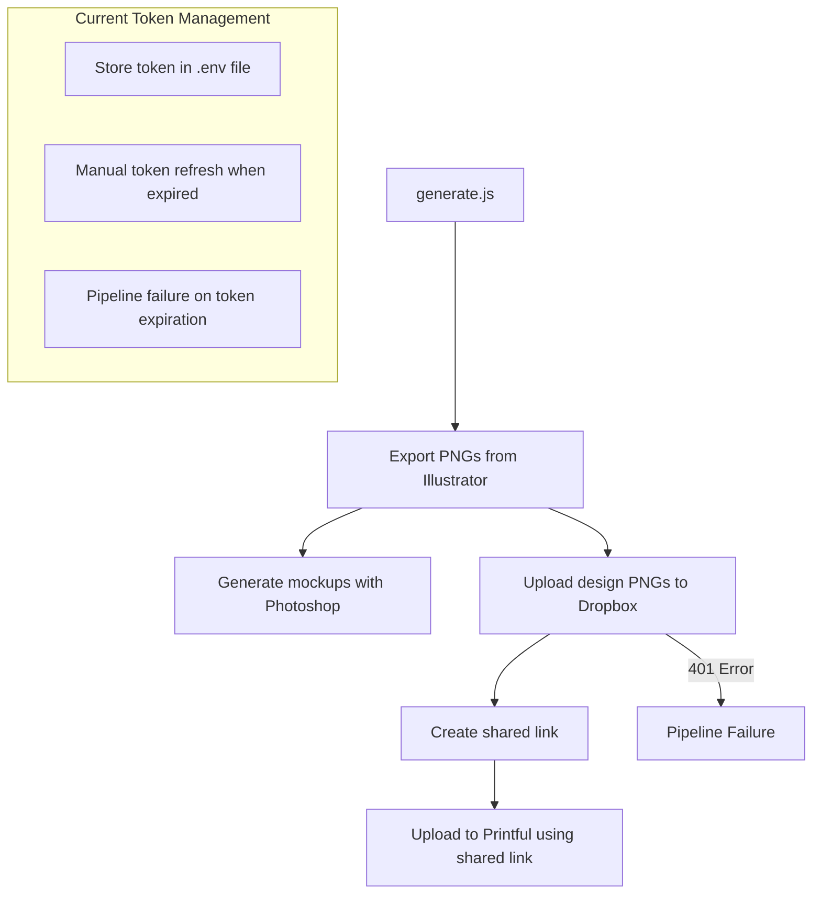
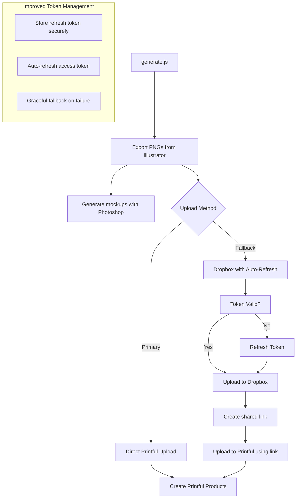

# Implementation Plan: Preventing Dropbox Token Expiration Issues

## Current System Analysis



## Problem Statement

The current implementation has several issues:
1. **Manual Token Management**: Dropbox access tokens are stored in the .env file and require manual updates when they expire
2. **Frequent Expiration**: You're experiencing frequent token expiration issues that disrupt your workflow
3. **Pipeline Failure**: When the token expires, the entire pipeline fails without graceful recovery
4. **Security Concerns**: Storing long-lived tokens in plaintext in .env files poses security risks

## Proposed Solutions

I'll outline two complementary approaches:

### Solution 1: Implement Automatic Token Refresh
Use Dropbox's OAuth 2.0 refresh token flow to automatically refresh access tokens when they expire.

### Solution 2: Direct Printful Upload Implementation
Implement Printful's direct file upload API as an alternative to using Dropbox as an intermediary.

## Target System Architecture



## Implementation Details

### 1. Dropbox OAuth 2.0 Implementation with Refresh Tokens

#### Code Changes:
- Update Dropbox initialization to use refresh tokens instead of access tokens
- Implement token storage and refresh mechanism
- Add automatic retry with refreshed token on 401 errors

#### Implementation Strategy:
1. Set up a local OAuth 2.0 flow to obtain both access and refresh tokens
2. Store refresh token securely (encrypted if possible)
3. Implement token refresh logic that triggers when access token expires
4. Add automatic retry mechanism for failed Dropbox operations

### 2. Direct Printful Upload Implementation

#### Code Changes:
- Implement direct file upload to Printful using multipart/form-data
- Update the pipeline to try direct upload first before falling back to Dropbox
- Add proper error handling for Printful API limitations

#### Implementation Strategy:
1. Research Printful's file upload API limitations (file size, formats, etc.)
2. Implement direct upload functionality using FormData and axios
3. Add fallback to Dropbox method if direct upload fails
4. Update the pipeline to use the most appropriate method based on file characteristics

### 3. Secure Token Storage

#### Code Changes:
- Implement secure storage for refresh tokens
- Add encryption for sensitive credentials
- Separate token storage from application code

#### Implementation Strategy:
1. Create a dedicated token manager module
2. Implement secure storage options (keychain, encrypted file, etc.)
3. Add token rotation and validation mechanisms

## Detailed Technical Implementation

### 1. Dropbox OAuth 2.0 Implementation

```javascript
// dropboxTokenManager.js

const fs = require('fs');
const path = require('path');
const crypto = require('crypto');
const { Dropbox } = require('dropbox');
const axios = require('axios');

// Configuration
const DROPBOX_APP_KEY = process.env.DROPBOX_APP_KEY;
const DROPBOX_APP_SECRET = process.env.DROPBOX_APP_SECRET;
const TOKEN_STORAGE_PATH = path.join(__dirname, '.tokens');
const ENCRYPTION_KEY = process.env.TOKEN_ENCRYPTION_KEY || 'default-encryption-key';

// Ensure token storage directory exists
if (!fs.existsSync(TOKEN_STORAGE_PATH)) {
  fs.mkdirSync(TOKEN_STORAGE_PATH, { recursive: true });
}

// Encrypt/decrypt functions for token security
function encrypt(text) {
  const iv = crypto.randomBytes(16);
  const cipher = crypto.createCipheriv('aes-256-cbc', Buffer.from(ENCRYPTION_KEY), iv);
  let encrypted = cipher.update(text);
  encrypted = Buffer.concat([encrypted, cipher.final()]);
  return iv.toString('hex') + ':' + encrypted.toString('hex');
}

function decrypt(text) {
  const parts = text.split(':');
  const iv = Buffer.from(parts[0], 'hex');
  const encryptedText = Buffer.from(parts[1], 'hex');
  const decipher = crypto.createDecipheriv('aes-256-cbc', Buffer.from(ENCRYPTION_KEY), iv);
  let decrypted = decipher.update(encryptedText);
  decrypted = Buffer.concat([decrypted, decipher.final()]);
  return decrypted.toString();
}

// Token storage functions
function saveTokens(tokens) {
  const encryptedTokens = encrypt(JSON.stringify(tokens));
  fs.writeFileSync(path.join(TOKEN_STORAGE_PATH, 'dropbox_tokens.enc'), encryptedTokens);
}

function loadTokens() {
  try {
    const encryptedTokens = fs.readFileSync(path.join(TOKEN_STORAGE_PATH, 'dropbox_tokens.enc'), 'utf8');
    return JSON.parse(decrypt(encryptedTokens));
  } catch (error) {
    return null;
  }
}

// Initialize OAuth flow
async function initializeOAuthFlow() {
  // This would typically be a web server endpoint
  // For a CLI app, we can use a local redirect
  console.log('Initializing Dropbox OAuth flow...');
  console.log(`Please visit: https://www.dropbox.com/oauth2/authorize?client_id=${DROPBOX_APP_KEY}&response_type=code&token_access_type=offline`);
  
  // In a real implementation, you would:
  // 1. Start a local web server to receive the redirect
  // 2. Open the browser to the authorization URL
  // 3. Receive the code via redirect
  // 4. Exchange the code for tokens
  
  // For this example, we'll simulate by asking for the code
  const code = await promptForCode();
  return await exchangeCodeForTokens(code);
}

// Exchange authorization code for tokens
async function exchangeCodeForTokens(code) {
  try {
    const response = await axios.post('https://api.dropboxapi.com/oauth2/token', null, {
      params: {
        code,
        grant_type: 'authorization_code',
        client_id: DROPBOX_APP_KEY,
        client_secret: DROPBOX_APP_SECRET
      }
    });
    
    const tokens = {
      access_token: response.data.access_token,
      refresh_token: response.data.refresh_token,
      expires_at: Date.now() + (response.data.expires_in * 1000)
    };
    
    saveTokens(tokens);
    return tokens;
  } catch (error) {
    console.error('Error exchanging code for tokens:', error.message);
    throw error;
  }
}

// Refresh access token using refresh token
async function refreshAccessToken(refreshToken) {
  try {
    const response = await axios.post('https://api.dropboxapi.com/oauth2/token', null, {
      params: {
        refresh_token: refreshToken,
        grant_type: 'refresh_token',
        client_id: DROPBOX_APP_KEY,
        client_secret: DROPBOX_APP_SECRET
      }
    });
    
    const tokens = {
      access_token: response.data.access_token,
      refresh_token: refreshToken, // Keep the same refresh token
      expires_at: Date.now() + (response.data.expires_in * 1000)
    };
    
    saveTokens(tokens);
    return tokens;
  } catch (error) {
    console.error('Error refreshing access token:', error.message);
    throw error;
  }
}

// Get a valid Dropbox client with auto-refresh capability
async function getDropboxClient() {
  let tokens = loadTokens();
  
  // If no tokens or refresh token is missing, initialize OAuth flow
  if (!tokens || !tokens.refresh_token) {
    tokens = await initializeOAuthFlow();
  }
  
  // If access token is expired, refresh it
  if (Date.now() >= tokens.expires_at) {
    console.log('Access token expired, refreshing...');
    tokens = await refreshAccessToken(tokens.refresh_token);
  }
  
  // Create Dropbox client with the access token
  const dbx = new Dropbox({ accessToken: tokens.access_token });
  
  // Add auto-refresh capability to the client
  const originalRequest = dbx.request;
  dbx.request = async function(...args) {
    try {
      return await originalRequest.apply(this, args);
    } catch (error) {
      if (error.status === 401) {
        console.log('Token expired during request, refreshing...');
        tokens = await refreshAccessToken(tokens.refresh_token);
        this.setAccessToken(tokens.access_token);
        return await originalRequest.apply(this, args);
      }
      throw error;
    }
  };
  
  return dbx;
}

module.exports = {
  getDropboxClient,
  initializeOAuthFlow
};
```

### 2. Direct Printful Upload Implementation

```javascript
// printfulUploader.js

const fs = require('fs');
const path = require('path');
const axios = require('axios');
const FormData = require('form-data');

// Configuration
const PRINTFUL_API_KEY = process.env.PRINTFUL_API_KEY;

// Create Axios instance for Printful API
const printfulApi = axios.create({
  baseURL: 'https://api.printful.com',
  headers: {
    'Authorization': `Bearer ${PRINTFUL_API_KEY}`
  }
});

/**
 * Upload file directly to Printful
 * @param {string} filePath - Path to local file
 * @returns {Promise<string>} Printful file URL
 */
async function uploadFileToPrintful(filePath, maxRetries = 3, retryDelay = 2000) {
  let lastError;
  
  for (let attempt = 1; attempt <= maxRetries; attempt++) {
    try {
      console.log(`⏳ Uploading file directly to Printful (attempt ${attempt}/${maxRetries})...`);
      
      // Get file stats for size information
      const stats = fs.statSync(filePath);
      console.log(`📊 File size: ${(stats.size / 1024).toFixed(2)} KB`);
      
      // Check if file size is within Printful's limits (typically 200MB)
      if (stats.size > 200 * 1024 * 1024) {
        throw new Error('File size exceeds Printful\'s 200MB limit');
      }
      
      const fileName = path.basename(filePath);
      
      // Create form data for multipart upload
      const form = new FormData();
      form.append('file', fs.createReadStream(filePath));
      form.append('type', 'default');
      form.append('filename', fileName);
      
      // Upload file to Printful
      const response = await printfulApi.post('/files', form, {
        headers: {
          ...form.getHeaders(),
          'Content-Length': stats.size
        },
        maxContentLength: Infinity,
        maxBodyLength: Infinity
      });
      
      if (response.data && response.data.result && response.data.result.url) {
        console.log(`✅ File uploaded directly to Printful: ${fileName}`);
        return response.data.result.url;
      } else {
        console.error('❌ Invalid response structure:', JSON.stringify(response.data));
        throw new Error('Invalid response from Printful file upload');
      }
    } catch (error) {
      lastError = error;
      
      // Check if this is a server error that might be temporary
      const isServerError = error.response && error.response.status >= 500;
      const isRateLimitError = error.response && error.response.status === 429;
      
      if ((isServerError || isRateLimitError) && attempt < maxRetries) {
        console.log(`⚠️ Temporary error: ${error.message}`);
        console.log(`⏳ Retrying in ${retryDelay / 1000} seconds...`);
        await new Promise(resolve => setTimeout(resolve, retryDelay));
        // Increase delay for next retry
        retryDelay *= 1.5;
      } else {
        console.error(`❌ Error uploading file to Printful:`, error.message);
        if (error.response) {
          console.error('❌ Server responded with:', error.response.status, error.response.data);
        }
        break;
      }
    }
  }
  
  // If we've exhausted all retries, throw the last error
  throw lastError;
}

module.exports = {
  uploadFileToPrintful
};
```

### 3. Updated Upload Pipeline with Fallback Strategy

```javascript
// fileUploader.js

const { getDropboxClient } = require('./dropboxTokenManager');
const { uploadFileToPrintful } = require('./printfulUploader');
const path = require('path');
const fs = require('fs');

// Configuration
const DROPBOX_FOLDER_PATH = process.env.DROPBOX_FOLDER_PATH || '/PrintfulImages';

/**
 * Upload file to Printful with fallback strategy
 * @param {string} filePath - Path to local file
 * @param {boolean} useFallback - Whether to use fallback if primary method fails
 * @returns {Promise<string>} File URL on Printful
 */
async function uploadFileWithFallbackStrategy(filePath, useFallback = true) {
  const fileName = path.basename(filePath);
  console.log(`🚀 Starting upload process for ${fileName}...`);
  
  try {
    // First attempt: Direct upload to Printful
    console.log(`⏳ Attempting direct upload to Printful...`);
    return await uploadFileToPrintful(filePath);
  } catch (directUploadError) {
    console.error(`❌ Direct upload failed: ${directUploadError.message}`);
    
    // If fallback is disabled or the error indicates a permanent issue, rethrow
    if (!useFallback || isPermanentError(directUploadError)) {
      throw directUploadError;
    }
    
    // Second attempt: Upload via Dropbox
    console.log(`⏳ Falling back to Dropbox upload method...`);
    try {
      return await uploadViaDropbox(filePath);
    } catch (dropboxError) {
      console.error(`❌ Dropbox fallback also failed: ${dropboxError.message}`);
      // Throw the original error as it's likely more relevant
      throw directUploadError;
    }
  }
}

/**
 * Upload file via Dropbox and create a shared link
 * @param {string} filePath - Path to local file
 * @returns {Promise<string>} Printful file URL
 */
async function uploadViaDropbox(filePath) {
  const fileName = path.basename(filePath);
  
  // Get Dropbox client with auto-refresh capability
  const dbx = await getDropboxClient();
  
  // Upload file to Dropbox
  console.log(`⏳ Uploading ${fileName} to Dropbox...`);
  const dropboxFilePath = `${DROPBOX_FOLDER_PATH}/${fileName}`;
  
  // Read the file as a buffer
  const fileBuffer = fs.readFileSync(filePath);
  
  // Upload to Dropbox
  const uploadResponse = await dbx.filesUpload({
    path: dropboxFilePath,
    contents: fileBuffer,
    mode: { '.tag': 'overwrite' }
  });
  
  console.log(`✅ File uploaded to Dropbox: ${uploadResponse.path_display}`);
  
  // Create shared link
  console.log(`⏳ Creating shared link...`);
  const linkResponse = await dbx.sharingCreateSharedLinkWithSettings({
    path: uploadResponse.path_display,
    settings: {
      requested_visibility: { '.tag': 'public' }
    }
  });
  
  // Convert to direct link
  const url = linkResponse.url;
  const directLink = url
    .replace('www.dropbox.com', 'dl.dropboxusercontent.com')
    .replace('?dl=0', '');
  
  console.log(`✅ Shared link created: ${directLink}`);
  
  // Add file to Printful using the shared link
  console.log(`⏳ Adding file to Printful using Dropbox link...`);
  const printfulResponse = await printfulApi.post('/files', {
    url: directLink,
    type: 'default',
    filename: fileName,
    visible: true
  });
  
  console.log(`✅ File added to Printful library via Dropbox: ${fileName}`);
  return printfulResponse.data.result.url;
}

/**
 * Determine if an error is permanent and should not trigger fallback
 * @param {Error} error - The error to check
 * @returns {boolean} Whether the error is permanent
 */
function isPermanentError(error) {
  // File size errors, format errors, etc. are permanent
  const permanentErrorMessages = [
    'exceeds',
    'invalid format',
    'not supported',
    'unauthorized',
    'forbidden'
  ];
  
  return permanentErrorMessages.some(msg => 
    error.message.toLowerCase().includes(msg)
  );
}

module.exports = {
  uploadFileWithFallbackStrategy
};
```

### 4. Integration with Main Pipeline

```javascript
// Updated uploadToPrintful.js (partial)

const { uploadFileWithFallbackStrategy } = require('./fileUploader');

// Replace existing uploadFileToPrintful function with the new strategy
async function processFile(filePath, isDryRun = DRY_RUN) {
  try {
    const word = extractWordFromFilePath(filePath);
    console.log(`\n🔄 Processing: ${word}`);
    
    // Skip actual processing in dry run mode
    if (isDryRun) {
      console.log(`🔍 DRY RUN: Would process ${word}`);
      return {
        word,
        success: true,
        mockUrl: `https://example.com/mockups/${word}.jpg`,
        productId: 'dry-run-id'
      };
    }
    
    // Upload the file using our new strategy with fallback
    const fileUrl = await uploadFileWithFallbackStrategy(filePath, true);
    
    // Rest of the function remains the same
    // ...
  } catch (error) {
    console.error(`❌ Error processing ${filePath}:`, error.message);
    throw error;
  }
}
```

## Security Considerations

1. **Token Storage**: Refresh tokens are stored encrypted rather than in plaintext
2. **Automatic Rotation**: Access tokens are automatically rotated when they expire
3. **Least Privilege**: The Dropbox app should be configured with minimal permissions
4. **Error Handling**: Improved error handling prevents exposing sensitive information

## Testing Strategy

1. **Unit Testing**:
   - Test token refresh mechanism with mocked API responses
   - Test direct upload functionality with small test files
   - Test fallback strategy with simulated failures

2. **Integration Testing**:
   - Test the full pipeline with both upload methods
   - Verify graceful handling of token expiration
   - Test with various file sizes and types

3. **Security Testing**:
   - Verify token encryption and storage
   - Test for token leakage in logs or error messages

## Implementation Steps

1. **Setup Phase**:
   - Register a Dropbox app with offline access permissions
   - Generate app key and secret
   - Update environment variables

2. **Development Phase**:
   - Implement token manager module
   - Implement direct Printful upload functionality
   - Create fallback strategy
   - Update main pipeline to use new upload strategy

3. **Testing Phase**:
   - Test token refresh flow
   - Test direct uploads with various file sizes
   - Test fallback mechanism
   - Verify error handling

4. **Deployment Phase**:
   - Update documentation
   - Deploy with secure token storage
   - Monitor for any issues

## Success Criteria

1. **Reliability**: No more pipeline failures due to token expiration
2. **Security**: Tokens are stored securely and rotated automatically
3. **Performance**: Direct uploads work efficiently for most files
4. **Resilience**: Fallback to Dropbox works when direct upload fails
5. **User Experience**: No manual token updates required