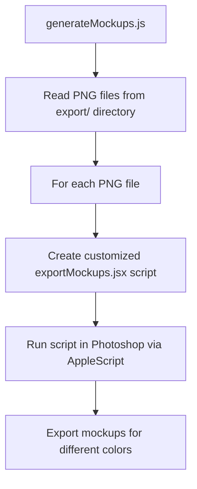

# generateMockups.js Implementation Plan

## Overview

The `generateMockups.js` script will automate the process of creating mockups for all PNG files in the export/ directory using the Photoshop template (gildan18000-template.psd) and the exportMockups.jsx script.

## System Architecture



## Implementation Details

### 1. File Processing
- Read all PNG files from the export/ directory
- Extract the word/design name from each filename (removing the .png extension)
- Process files sequentially to avoid conflicts

### 2. Script Generation
- Create a modified version of exportMockups.jsx for each PNG file
- Replace the interactive prompt with the specific design name
- Ensure all paths are correctly set

### 3. Photoshop Integration
- Use AppleScript to open the template PSD in Photoshop if not already open
- Run the customized JSX script in Photoshop
- Handle any errors that might occur

### 4. Output Management
- Create the export-mockups/ directory if it doesn't exist
- Organize mockups by color as specified in the exportMockups.jsx script
- Provide clear logging of the process

## Code Structure

The script will be organized into the following sections:

1. **Imports and Configuration**
   ```javascript
   const fs = require('fs');
   const path = require('path');
   const { exec } = require('child_process');
   
   // Configuration
   const EXPORT_DIR = path.join(__dirname, 'export');
   const MOCKUPS_DIR = path.join(__dirname, 'export-mockups');
   const TEMPLATE_PSD = path.join(__dirname, 'gildan18000-template.psd');
   const EXPORT_MOCKUPS_TEMPLATE = path.join(__dirname, 'exportMockups.jsx');
   ```

2. **Helper Functions**
   ```javascript
   // Get all PNG files from the export directory
   function getPngFilesFromExport() {...}
   
   // Extract design name from file path
   function extractDesignNameFromFilePath(filePath) {...}
   
   // Create customized exportMockups.jsx script
   function createCustomScript(designName) {...}
   
   // Run script in Photoshop
   function runInPhotoshop(scriptPath) {...}
   ```

3. **Main Process Flow**
   ```javascript
   // Process a single file
   async function processFile(filePath) {...}
   
   // Main function
   async function main() {
     // Create export-mockups directory if it doesn't exist
     if (!fs.existsSync(MOCKUPS_DIR)) {
       fs.mkdirSync(MOCKUPS_DIR);
     }
     
     // Get all PNG files
     const files = getPngFilesFromExport();
     
     // Process each file
     for (const file of files) {
       await processFile(file);
     }
   }
   ```

## Modifications to exportMockups.jsx

The current exportMockups.jsx script requires user interaction to input the design name. We need to modify it to accept the design name as a parameter or hardcode it in the generated script. Here's how we'll modify it:

1. Remove the prompt for design name:
   ```javascript
   // Original
   var designName = prompt("Enter design filename (no extension):", "");
   
   // Modified (will be replaced with actual design name)
   var designName = "{{DESIGN_NAME}}";
   ```

2. Ensure the script opens the template PSD:
   ```javascript
   // Add at the beginning of the script
   var templateFile = File("~/Desktop/illustrator-automation/gildan18000-template.psd");
   app.open(templateFile);
   var doc = app.activeDocument;
   ```

## Command-Line Options

We'll add command-line options similar to those in uploadToPrintful.js:

1. **--limit=N**: Process only the first N files
2. **--design=NAME**: Process only a specific design by name

## Error Handling

- Implement robust error handling for file operations and AppleScript execution
- Log all operations for debugging purposes
- Continue processing other files if one fails

## Testing Strategy

1. Test with a single PNG file first
2. Verify that mockups are generated correctly for all colors
3. Test with multiple PNG files to ensure batch processing works
4. Check error handling by intentionally using invalid files

## Future Enhancements

1. Add support for different templates
2. Implement parallel processing for improved efficiency
3. Add a web interface for monitoring the mockup generation process