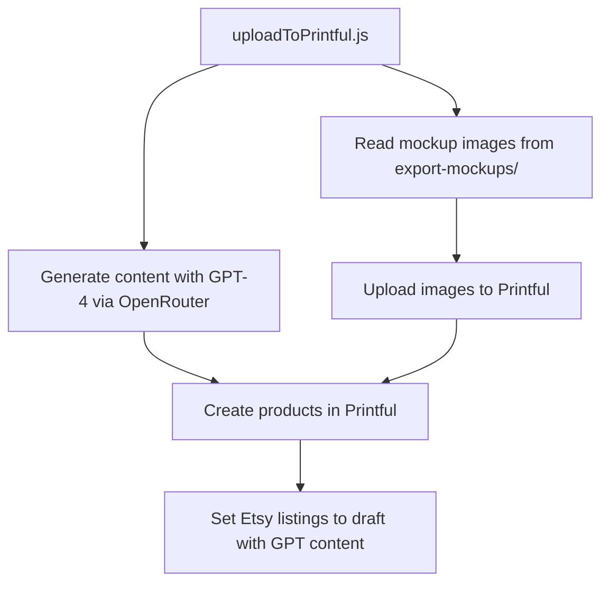

# Printful Integration Plan with GPT-Generated Content

## Overview

This plan outlines the implementation of a new script (`uploadToPrintful.js`) that will:

1. Read the mockup images generated by the previous steps
2. Use GPT-4 via OpenRouter to generate product titles, descriptions, and tags
3. Upload mockup images to Printful
4. Create draft products in Printful with Etsy sync enabled
5. Apply the GPT-generated content to the Etsy listings

## System Architecture



## GPT Content Generation

The existing `generateListingFromOpenRouter.js` module will be used to generate high-quality, SEO-optimized content for each product, following your best-seller format:

1. **Title**: Structured as "[FOOD] Sweatshirt - Cute Oversized Unisex Crewneck, A Perfect Gift for [FOOD] Lovers..."
2. **Description**: Two-part structure:
   - Custom introduction about the specific food item
   - Standardized sections for details, processing, satisfaction guarantee, and feedback
3. **Emojis**: Food-specific emojis that represent the product
4. **Tags**: Up to 13 Etsy-friendly tags for improved discoverability

We'll update the prompt for GPT-4 to follow your best-seller format:
```
Write Etsy product copy for a sweatshirt that says "${word}" in bold collegiate font.
Follow this exact format:

TITLE:
[FOOD] Sweatshirt - Cute Oversized Unisex Crewneck, A Perfect Gift for [FOOD] Lovers and [CUISINE] Enthusiasts.

DESCRIPTION:
[FOOD-SPECIFIC EMOJIS]
[CUSTOM INTRODUCTION ABOUT THE SPECIFIC FOOD - 3-4 sentences about the food's cultural significance, why people love it, etc.]

---Standard sections below with food-specific emojis---

[FOOD-SPECIFIC EMOJIS] - DETAILS

• 50% cotton, 50% polyester
• Pre-shrunk
• Classic fit
• 1x1 athletic rib knit collar with spandex
• Air-jet spun yarn with a soft feel and reduced pilling
• Double-needle stitched collar, shoulders, armholes, cuffs, and hem

[FOOD-SPECIFIC EMOJIS] - FAST PROCESSING

After you place the order, it goes into production the same day. All orders are processed individually.

[FOOD-SPECIFIC EMOJIS] - 100% SATISFACTION GUARANTEE

If you have any comments or concerns always feel free to contact us. It is our goal to provide quality products with the highest level of customer satisfaction.

[FOOD-SPECIFIC EMOJIS] - FEEDBACK

We are a new Etsy store, so please, leave us feedback, as we are always looking for ways to improve our service. Thank you for your business, your support, and your continued feedback.

Output JSON like:
{
  "word": "${word}",
  "title": "...",
  "emojis": "...",
  "description": "...",
  "tags": ["..."]
}
```

## Implementation Details

### 1. Environment Setup
- Add Printful API key to .env file
- Update package.json with any additional dependencies

### 2. File Processing
- Read all mockup images from the export-mockups/ directory
- Group mockups by design name
- Process files sequentially to avoid rate limiting issues

### 3. GPT Content Generation
- Use the existing generateListingFromOpenRouter.js module to create listing content for each design
- Generate:
  - SEO-optimized title
  - Detailed product description with emojis and formatting
  - Up to 13 relevant tags for Etsy search
- Handle any errors in the content generation process
- Implement retry logic for failed API calls
- Cache generated content to avoid redundant API calls

### 4. Printful Integration

#### 4.1 File Upload
- Upload each mockup image to Printful using the `/files` endpoint
- Store the returned file URLs for use in product creation

#### 4.2 Get Printfile Information
- Retrieve printfile dimensions for the Gildan 18000 sweatshirt
- This information is needed to properly position our designs on the sweatshirt
- Use the `/mockup-generator/printfiles/{product_id}` endpoint to get this information

#### 4.3 Product Creation with Proper File Positioning
- Create a new Sync Product for each design using the `/store/products` endpoint
- Add Sync Variants for different sizes and colors of the Gildan 18000 sweatshirt
- Include proper file positioning information to ensure the design is centered:
  ```javascript
  files: [
    {
      type: "front",
      url: fileUrl,
      position: {
        area_width: printfile.width,
        area_height: printfile.height,
        width: designWidth,
        height: designHeight,
        top: (printfile.height - designHeight) / 2, // Center vertically
        left: (printfile.width - designWidth) / 2,  // Center horizontally
        limit_to_print_area: true
      }
    }
  ]
  ```
- Set up the product for Etsy sync
- Apply the GPT-generated content to the Etsy listing:
  ```javascript
  etsy: {
    title: listingContent.title,
    description: listingContent.description,
    tags: listingContent.tags,
    state: 'draft',
    who_made: 'i_did',
    when_made: 'made_to_order',
    shipping_template_id: 1,
    shop_section_id: 1,
    non_taxable: false,
    is_customizable: false,
    image_ids: []
  }
  ```

### 5. Error Handling and Logging
- Implement robust error handling for API calls
- Log all operations for debugging purposes
- Create a summary report of successful and failed uploads

## API Endpoints to Use

### 1. OpenRouter API (for GPT content generation)
- Already implemented in generateListingFromOpenRouter.js

### 2. Printful File Upload
- `POST /files` - Upload mockup images

### 3. Printful Product Creation
- `POST /store/products` - Create a new Sync Product with Etsy sync
- `POST /store/products/{id}/variants` - Add variants to a Sync Product

## Code Structure

The script will be organized into the following sections:

```javascript
// 1. Imports and Configuration
require('dotenv').config();
const fs = require('fs');
const path = require('path');
const axios = require('axios');
const FormData = require('form-data');
const generateListing = require('./generateListingFromOpenRouter');

// Configuration
const PRINTFUL_API_KEY = process.env.PRINTFUL_API_KEY;
const MOCKUPS_DIR = path.join(__dirname, 'export-mockups');
const GILDAN_18000_PRODUCT_ID = 146; // Gildan 18000 Heavy Blend Crewneck Sweatshirt

// Variant IDs for different sizes and colors
const VARIANT_IDS = {
  // Example format: 'color-size': variantId
  'white-S': 4781,
  'white-M': 4782,
  'white-L': 4783,
  'white-XL': 4784,
  'white-2XL': 4785,
  'black-S': 4786,
  'black-M': 4787,
  'black-L': 4788,
  'black-XL': 4789,
  'black-2XL': 4790,
};

// Create Axios instance for Printful API
const printfulApi = axios.create({
  baseURL: 'https://api.printful.com',
  headers: {
    'Authorization': `Bearer ${PRINTFUL_API_KEY}`,
    'Content-Type': 'application/json'
  }
});

// 2. Helper Functions
async function getMockupFiles() {...}
async function groupMockupsByDesign(files) {...}
async function generateContentWithGPT(designName) {...}
async function uploadFileToPrintful(filePath) {...}
async function createProductWithEtsySync(designName, mockupUrls, listingContent) {...}

// 3. Main Process Flow
async function processDesign(designName, mockupFiles) {...}
async function main() {...}

// 4. Execution
main().catch(error => {
  console.error('❌ Unhandled error:', error);
  process.exit(1);
});
```

## Implementation Steps

### 1. Set Up Environment
- Add the Printful API key to the .env file
- Install any required dependencies

### 2. Implement File Reading and Grouping
- Read all files from the export-mockups directory
- Group files by design name (extract from filename)

### 3. Implement GPT Content Generation
- Create a function to generate content using generateListingFromOpenRouter.js
- Cache generated content to avoid redundant API calls

### 4. Implement File Upload
- Create a function to upload files to Printful
- Handle errors and retries

### 5. Implement Product Creation
- Create a function to create a Sync Product with Etsy sync
- Add variants for different sizes and colors
- Apply the GPT-generated content to the Etsy listing

### 6. Implement Main Process Flow
- Process each design sequentially
- Generate listing content with GPT
- Upload mockup images
- Create products with GPT content
- Log results

### 7. Add Command-Line Options
- Add options for dry run, limiting the number of designs, etc.

## Example GPT-Generated Content

For a sweatshirt with the word "TACOS":

```json
{
  "word": "TACOS",
  "title": "TACOS Sweatshirt - Cute Oversized Unisex Crewneck, A Perfect Gift for Mexican Food Lovers, Taco Tuesday Enthusiasts, and Latin Cuisine Fans",
  "emojis": "🌮 🇲🇽",
  "description": "🌮 🇲🇽\nReady to look cute and feel cozy? Our \"TACOS\" sweatshirt is a celebration of everyone's favorite Mexican street food. Whether you're a fan of carne asada, al pastor, or fish tacos, this preppy and oversized unisex sweatshirt is the perfect way to show off your passion for authentic Latin cuisine. Made from soft, air-jet spun yarn, this classic fit sweater offers a comfortable and cozy fit that's perfect for Taco Tuesdays or any casual occasion. With its preppy and college-inspired style, this sweatshirt is the ideal choice for anyone who wants to make a statement with their fashion choices. So why wait? Show your love for Mexican culture and your appreciation for delicious food with the \"TACOS\" sweatshirt today!\n\n🌮 🇲🇽 - DETAILS\n\n• 50% cotton, 50% polyester\n• Pre-shrunk\n• Classic fit\n• 1x1 athletic rib knit collar with spandex\n• Air-jet spun yarn with a soft feel and reduced pilling\n• Double-needle stitched collar, shoulders, armholes, cuffs, and hem\n\n🌮 🇲🇽 - FAST PROCESSING\n\nAfter you place the order, it goes into production the same day. All orders are processed individually.\n\n\n🌮 🇲🇽 - 100% SATISFACTION GUARANTEE\n\nIf you have any comments or concerns always feel free to contact us. It is our goal to provide quality products with the highest level of customer satisfaction.\n\n\n🌮 🇲🇽 - FEEDBACK\n\nWe are a new Etsy store, so please, leave us feedback, as we are always looking for ways to improve our service. Thank you for your business, your support, and your continued feedback.",
  "tags": ["taco sweatshirt", "mexican food gift", "taco tuesday", "food lover", "collegiate style", "oversized crewneck", "mexican cuisine", "taco lover", "latin food", "preppy sweatshirt", "unisex sweatshirt", "food enthusiast", "cute sweatshirt"]
}
```

This follows your best-seller format with:
1. A title that follows the specified structure
2. Food-specific emojis (🌮 🇲🇽)
3. A custom introduction about tacos
4. The standardized sections for details, processing, satisfaction guarantee, and feedback
5. Relevant tags for Etsy search optimization

## Testing Strategy

1. Test with a small subset of designs first
2. Verify that GPT generates appropriate content
3. Verify that files are uploaded correctly
4. Verify that file positioning is correct on the sweatshirt
5. Verify that products are created with the correct variants and GPT content
6. Verify that Etsy sync is set up correctly

## Future Enhancements

1. Add support for different product types
2. Implement batch processing for improved efficiency
3. Add a web interface for monitoring uploads
4. Add support for updating existing products
5. Implement A/B testing for different GPT-generated content styles