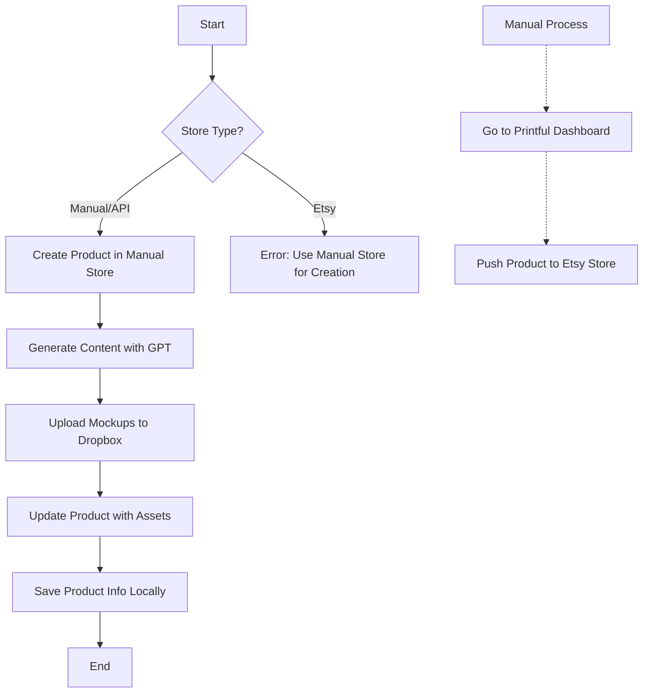

# Printful Manual Store Implementation Plan

## Current Understanding

1. You've created a new Manual/API Printful store named 'Compliments API Staging'
2. You've generated a new API key for this store: `7KyEhqwkjvKB2vLibnOJdl70sdIZTsRRlwBTqu5d`
3. The new store ID is: `15954632`
4. Your current script is failing because the Etsy-linked store doesn't support the product creation API endpoints

## Detailed Implementation Plan

### 1. Update the .env File

We need to update your .env file to include both API keys and store IDs, allowing you to switch between them as needed:

```
# Original Etsy-linked store
PRINTFUL_ETSY_API_KEY=9Vnv1mGRQePCZVYvHqcLqUIl2rrwX1dDNUajf86X
PRINTFUL_ETSY_STORE_ID=12830533

# Manual/API store for product creation
PRINTFUL_API_KEY=7KyEhqwkjvKB2vLibnOJdl70sdIZTsRRlwBTqu5d
PRINTFUL_STORE_ID=15954632
```

### 2. Modify the Script to Support Multiple Stores

We'll enhance the script to:
- Accept a `--store` parameter to specify which store to use (defaulting to the Manual/API store)
- Add store selection logic to use the appropriate API key
- Add documentation about the multi-store workflow

### 3. Add Store Transfer Documentation

We'll add documentation explaining the workflow:
1. Create products in the Manual/API store using the script
2. Use Printful's dashboard to manually push products to your Etsy store

### 4. Implementation Details

Here's how we'll modify the script:

1. **Add Command Line Arguments**:
   - Add a `--store` parameter to specify which store to use (default to "manual")
   - Update help text to explain the store options

2. **Add Store Selection Logic**:
   - Create a function to get the appropriate API key based on the selected store
   - Update API calls to use the selected store's API key

3. **Update Error Handling**:
   - Add specific error handling for store-related issues
   - Provide helpful error messages if the wrong store type is used for certain operations

4. **Add Documentation**:
   - Update comments to explain the multi-store workflow
   - Add examples showing how to use the script with different stores

## Updated Workflow Diagram



## Code Changes

### 1. Add Store Selection Function

```javascript
/**
 * Gets the appropriate API key and store ID based on the selected store
 * @param {string} storeType - The type of store to use ('manual' or 'etsy')
 * @returns {Object} - Object containing the API key and store ID
 */
function getStoreCredentials(storeType = 'manual') {
  if (storeType === 'etsy') {
    return {
      apiKey: process.env.PRINTFUL_ETSY_API_KEY,
      storeId: process.env.PRINTFUL_ETSY_STORE_ID,
      name: 'Etsy-linked store'
    };
  } else {
    return {
      apiKey: process.env.PRINTFUL_API_KEY,
      storeId: process.env.PRINTFUL_STORE_ID,
      name: 'Manual/API store'
    };
  }
}
```

### 2. Update API Calls

Update all API calls to use the selected store's API key:

```javascript
const storeCredentials = getStoreCredentials(storeType);

// Example API call
const response = await fetch('https://api.printful.com/store/products', {
  method: 'POST',
  headers: {
    'Authorization': `Bearer ${storeCredentials.apiKey}`,
    'Content-Type': 'application/json',
  },
  body: JSON.stringify({
    template_id: templateId,
    sync_product: {
      name: "TEMP - Placeholder",
      description: "Auto-generated product awaiting final assets.",
    },
  }),
});
```

### 3. Update Command Line Arguments

```javascript
// Parse arguments
const sweatshirtText = args[0];
const mockupPath = args[1];
const isDryRun = args.includes('--dry-run') || args.includes('-d');
const storeType = args.includes('--etsy') ? 'etsy' : 'manual';
```

### 4. Update Help Text

```javascript
console.log(`
📋 automatePrintfulProductFromTemplate.js Help:

This script automates the creation of Printful products from a saved template.

Usage:
  node automatePrintfulProductFromTemplate.js <sweatshirtText> <mockupPath> [options]

Arguments:
  sweatshirtText    The text on the sweatshirt (e.g., "PASTA")
  mockupPath        Path to the mockup image file

Options:
  --help, -h        Show this help text
  --dry-run, -d     Run in dry-run mode (no actual API calls)
  --etsy            Use the Etsy-linked store (not recommended for product creation)

Store Workflow:
  1. Create products in the Manual/API store (default)
  2. Manually push products to your Etsy store using Printful's dashboard

Examples:
  node automatePrintfulProductFromTemplate.js "PASTA" "./export-mockups/PASTA/PASTA-BLACK.png"
  `);
```

## Next Steps

1. Update the .env file with both store credentials
2. Implement the store selection function
3. Update all API calls to use the selected store's credentials
4. Add command line arguments for store selection
5. Update help text and documentation
6. Test the script with the Manual/API store