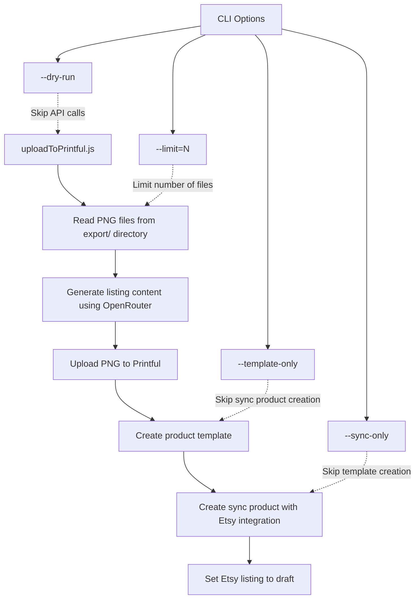
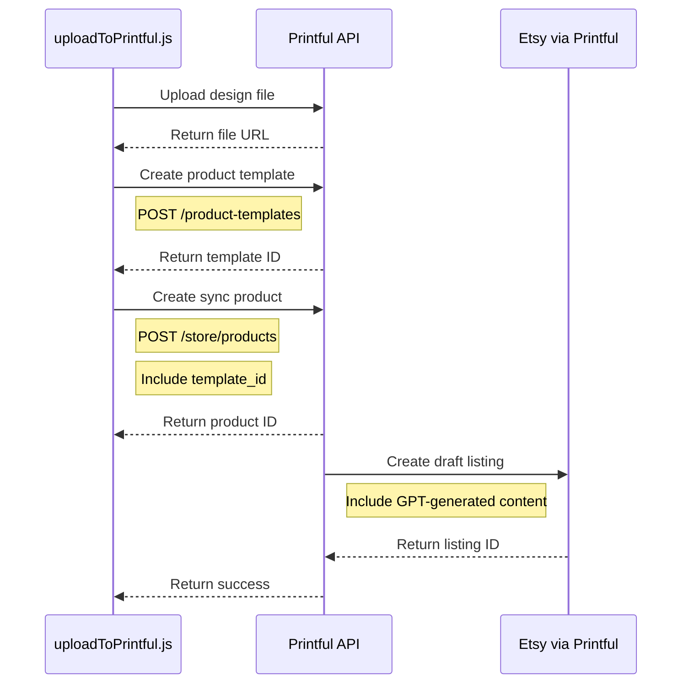
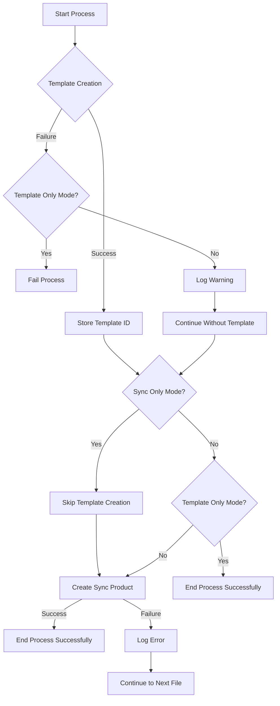
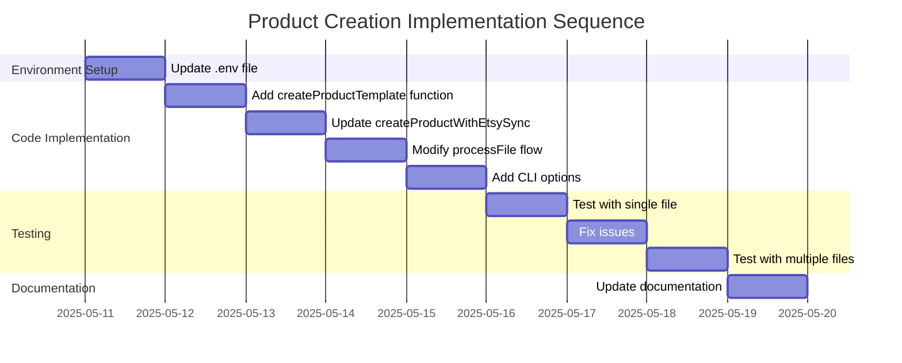
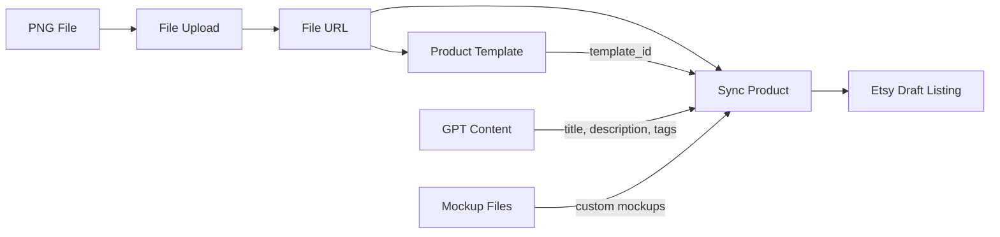

# Product Creation Workflow

## Updated System Architecture



## Product Template Creation Process



## Error Handling Strategy



## Implementation Sequence



## Data Flow



## CLI Options Decision Tree

```mermaid
flowchart TD
    A[Start Script] --> B{--dry-run?}
    B -->|Yes| C[Skip API Calls]
    B -->|No| D{--template-only?}
    
    D -->|Yes| E[Create Templates Only]
    D -->|No| F{--sync-only?}
    
    F -->|Yes| G[Create Sync Products Only]
    F -->|No| H[Full Process]
    
    I{--limit=N?} -->|Yes| J[Process N Files]
    I -->|No| K[Process All Files]
    
    C --> I
    E --> I
    G --> I
    H --> I