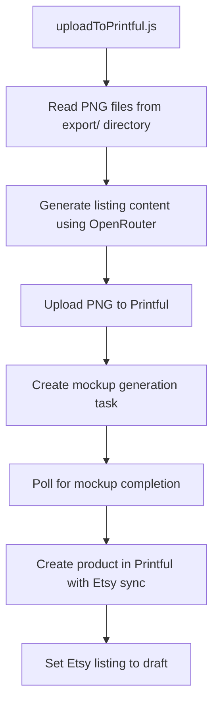

# uploadToPrintful.js Implementation Plan

## Overview

The `uploadToPrintful.js` script will complete the end-to-end pipeline by:

1. Processing all PNG files in the export/ directory
2. Using generateListingFromOpenRouter.js to create content for each one
3. Using the Printful Mockup Generator API to generate mockups
4. Creating draft listings on Etsy through Printful's API
5. Handling errors and providing logging

## System Architecture



## Implementation Details

### 1. Environment Setup
- Add Printful API key and store ID to .env file
- Update package.json with any additional dependencies (form-data for file uploads)

### 2. File Processing
- Read all PNG files from the export/ directory
- Extract the word from the filename (removing the .png extension)
- Process files sequentially to avoid rate limiting issues

### 3. Content Generation
- Use the existing generateListingFromOpenRouter.js module to create listing content for each word
- Handle any errors in the content generation process
- Implement retry logic for failed API calls

### 4. Printful Integration

#### 4.1 File Upload
- Upload the PNG file to Printful using the `/files` endpoint
- Store the returned file URL for use in mockup generation

#### 4.2 Product and Variant Information
- Get product ID for the Gildan 18000 Heavy Blend Crewneck Sweatshirt
- Get variant IDs for different sizes and colors
- Retrieve printfile information using `/mockup-generator/printfiles/{product_id}`

#### 4.3 Mockup Generation
- Create a mockup generation task with front placement only using `/mockup-generator/create-task/{product_id}`
- Include proper positioning parameters based on the printfile dimensions
- Poll the task status using `/mockup-generator/task?task_key={task_key}` until completion
- Store mockup URLs (note: these expire after 72 hours)

### 5. Etsy Integration
- Create a product in Printful with Etsy sync enabled using `/store/products`
- Set the Etsy listing to draft status
- Include all the generated content (title, description, tags)
- Associate the generated mockups with the product

### 6. Error Handling and Logging
- Implement robust error handling for API calls
- Log all operations for debugging purposes
- Create a summary report of successful and failed uploads

## Code Structure

The script will be organized into the following sections:

1. **Imports and Configuration**
   ```javascript
   require('dotenv').config();
   const fs = require('fs');
   const path = require('path');
   const axios = require('axios');
   const FormData = require('form-data');
   const generateListing = require('./generateListingFromOpenRouter');
   ```

2. **Helper Functions**
   ```javascript
   // File reading and processing
   async function getPngFilesFromExport() {...}
   
   // API interaction functions
   async function uploadFileToPrintful(filePath) {...}
   async function getPrintfileInfo(productId) {...}
   async function createMockupGenerationTask(productId, fileUrl, variantIds) {...}
   async function checkMockupTaskStatus(taskKey) {...}
   async function createProductWithEtsySync(word, listingContent, mockupUrls) {...}
   
   // Error handling utilities
   function handleError(error, operation, word) {...}
   ```

3. **Main Process Flow**
   ```javascript
   async function processFile(filePath) {...}
   
   async function main() {
     const files = await getPngFilesFromExport();
     for (const file of files) {
       await processFile(file);
     }
   }
   ```

## API Endpoints to Use

### 1. File Upload
- `POST /files` - Upload PNG files

### 2. Mockup Generator
- `GET /mockup-generator/printfiles/{product_id}` - Get printfile information
- `POST /mockup-generator/create-task/{product_id}` - Create mockup generation task
- `GET /mockup-generator/task?task_key={task_key}` - Check task status

### 3. Product Creation
- `POST /store/products` - Create product with Etsy sync

## Mockup Generation Process

1. **Get Printfile Information**
   - Determine the required dimensions and placements for the product
   - For Gildan 18000, we'll use the front placement only

2. **Create Mockup Task**
   - Specify variant IDs for different sizes and colors
   - Set the format to PNG for transparency
   - Include the file URL and proper positioning
   - Use option_groups and options to limit generated mockups as needed

3. **Poll for Task Completion**
   - Wait at least 10 seconds before first check
   - Implement exponential backoff for subsequent checks
   - Timeout after a reasonable period (e.g., 2 minutes)

4. **Process Mockup Results**
   - Download and store mockup URLs
   - Associate mockups with the product creation

## Error Handling Strategy

- Implement retry logic for transient errors (3 attempts with exponential backoff)
- Log detailed error information for debugging
- Continue processing other files if one fails
- Generate a summary report at the end

## Testing Strategy

- Test with a small subset of files first
- Verify mockup generation works correctly
- Confirm Etsy draft listings are created properly
- Check all error handling paths

## Future Enhancements

- Add support for multiple placements (front and back)
- Implement batch processing for improved efficiency
- Add a CLI interface with options for customization
- Create a web interface for monitoring uploads